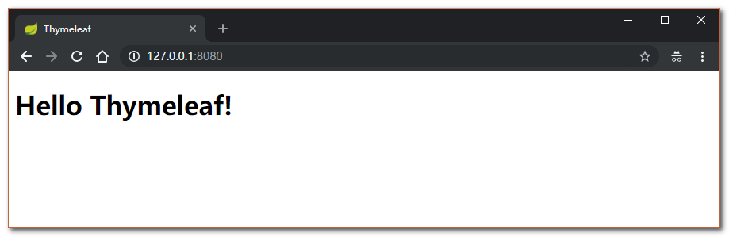
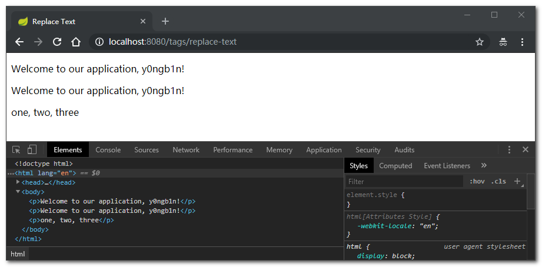
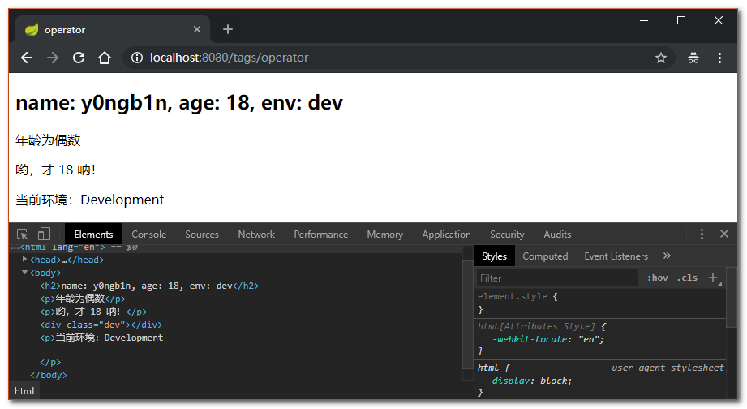
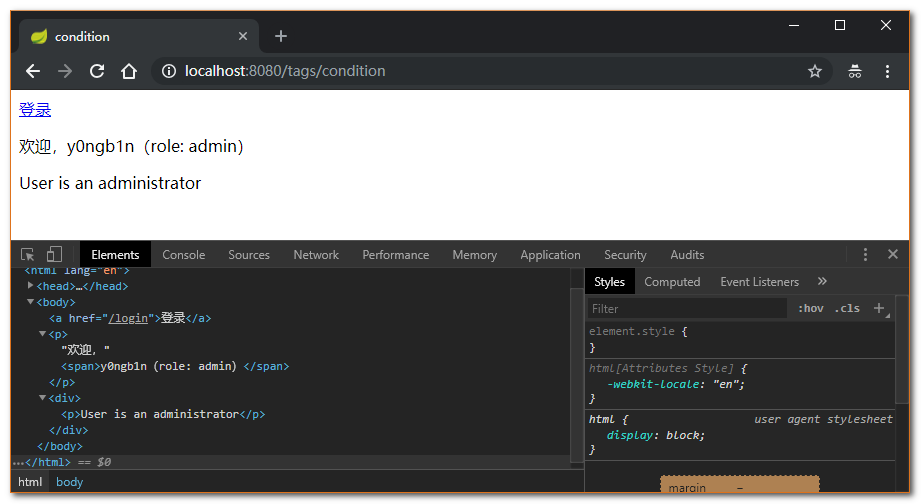
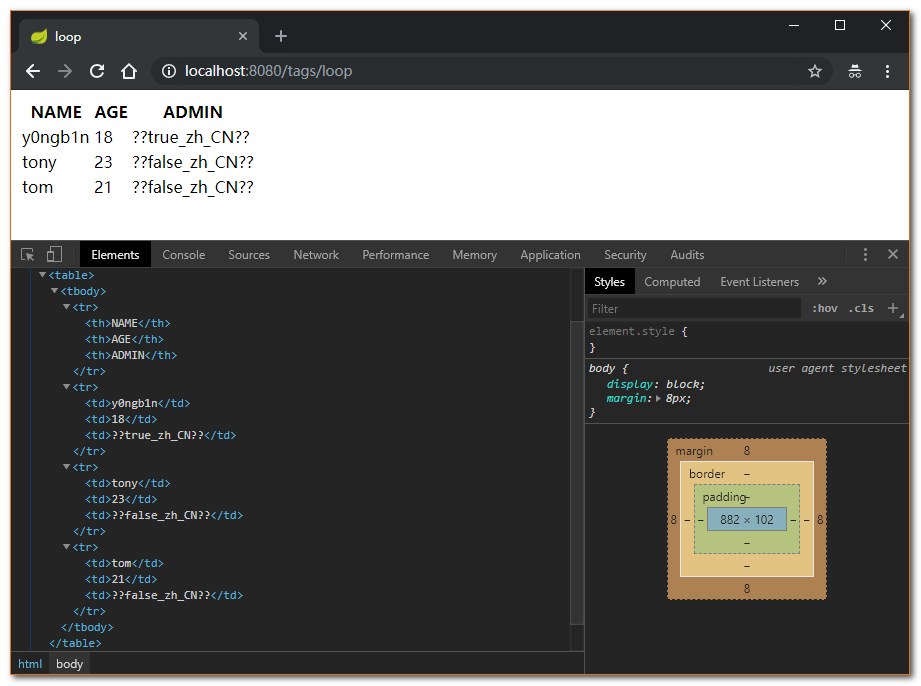

# Demo project for Thymeleaf

## 开发环境

```xml
<parent>
  <groupId>org.springframework.boot</groupId>
  <artifactId>spring-boot-starter-parent</artifactId>
  <version>2.1.0.RELEASE</version>
</parent>

<properties>
  <java.version>1.8</java.version>
</properties>
```

## 引入依赖

主要增加 `spring-boot-starter-thymeleaf` 依赖：

- `spring-boot-starter-thymeleaf`：自动装配 Thymeleaf 模板引擎

```xml
<dependencies>
  ...

  <!-- Thymeleaf Start -->
  <dependency>
    <groupId>org.springframework.boot</groupId>
    <artifactId>spring-boot-starter-thymeleaf</artifactId>
  </dependency>
  <!-- Thymeleaf End -->
  
  ...
</dependencies>
```

## 配置 Thymeleaf

`application.yml`

```yml
spring:
  thymeleaf:
    cache: false                  # 是否开启模板缓存，默认为：true，开发时关闭缓存，不然没法看到实时页面！
    mode: HTML                    # 指定模板的模式，默认为：HTML
    encoding: UTF-8               # 指定模板的编码，默认为：UTF-8
    prefix: classpath:/templates/ # 指定模板的前缀，默认为：classpath:/templates/
    suffix: .html                 # 指定模板的后缀，默认为：.html
    servlet:
      content-type: text/html     # 指定 Content-Type 值，默认为：text/html
```

从 `org.thymeleaf.templatemode.TemplateMode` 中可见 `Thymeleaf` 从 `3.0.0` 版本开始使用 `HTML` 替代 `HTML5、LEGACYHTML5、XHTML、VALIDXHTML`。如果还在使用 `3.0.0` 以前的版本，想要使用非严格的 HTML，需要做以下配置：

- 在 `pom.xml` 中引入 `nekohtml` 依赖
- 在 `application.yml` 中配置 `spring.thymeleaf.mode=LEGACYHTML5`

更多属性配置请参考「[Appendix A. Common application properties](https://docs.spring.io/spring-boot/docs/2.1.0.RELEASE/reference/htmlsingle/#common-application-properties)」中 `# THYMELEAF (ThymeleafAutoConfiguration)` 模块的属性介绍。（TIPS：使用 `CTRL + F` 进行快速定位）

## 创建测试 Controller

创建一个 Controller，为 `message` 属性赋值并设置跳转，代码如下：

`IndexController.java`

```java
@Controller
public class IndexController {

  @GetMapping(path = {"/", "index"})
  public String indexPage(Model model) {
    model.addAttribute("message", "Hello Thymeleaf!");
    return "index";
  }
}
```

## 创建测试 HTML 页面

在 `templates` 目录下创建 `index.html` 文件，并在 `html` 标签中声明 Thymeleaf 命名空间 `xmlns:th="http://www.thymeleaf.org"`，代码如下：

`index.html`

```html
<!DOCTYPE html>
<html lang="en" xmlns:th="http://www.thymeleaf.org">
  <head>
    <meta charset="UTF-8"/>
    <title>Thymeleaf</title>
  </head>
  <body>
    <h1 th:text="${message}">Hello World!</h1>
  </body>
</html>
```

其中关键的代码是：

> xmlns:th="http://www.thymeleaf.org"

主要是让 IDE 识别 Thymeleaf 命名空间，这样在标签里输入 `th:` 后，IDE 会提示相应的语法，方便开发！不加入这句代码也不会影响 Thymeleaf 模板引擎的渲染，以及页面的正常显示。

## 测试访问

启动成功后，访问 [http://127.0.0.1:8080](http://127.0.0.1:8080)，即可看到效果：



访问结果：`Hello Thymeleaf!`

---

## Thymeleaf 常用语法

- JAVA 源码路径：[TagsController.java](./src/main/java/io/github/y0ngb1n/boot/thymeleaf/controller/TagsController.java)
- HTML 源码路径：`templates` 目录

### 获取变量值

```html
<p th:text="'Hello! ' + ${name} + '!'" >name</p>
```

可以看出获取变量值用 `$` 符号，对于 JavaBean 的话使用 `变量名.属性名` 方式获取，这点和 `EL` 表达式一样。

另外 `$` 表达式只能写在 `th` 标签内部，不然不会生效，上面例子就是使用 `th:text` 标签的值替换 `<p>...</p>` 标签里面的值，至于 `p` 里面的原有的值只是为了给前端开发时做展示用的。这样的话很好的做到了前后端分离。

### 内容信息输出：`th:text` 与 `th:utext`

- `th:text`：以纯文本的方式输出
- `th:utext`：以 HTML 标签的方式输出，浏览器能正常渲染


HTML 代码：

```html
<body>
  <h2 th:text="' th:text &nbsp » ' + ${content}">以纯文本的方式输出</h2>
  <h2 th:utext="'th:utext      » ' + ${content}">以 HTML 标签的方式输出，浏览器能正常渲染</h2>
</body>
```

JAVA 代码：

```java
@GetMapping("/text-utext")
public String textAndutext(Model model) {
  model.addAttribute("content", "<span style='color:red'>thymeleaf text output</span>");
  return "text-utext";
}
```

### 引用 URL

对于 URL 的处理是通过语法 `@{…}` 来处理的：


HTML 代码：

```html
<body>
  <ul>
    <li>
      <a th:href="@{https://github.com/{username}(username=${username})}">绝对路径 1</a>，
      <a th:href="@{https://www.baidu.com}">绝对路径 2</a>
    </li>
    <li>
      <a th:href="@{/}">相对路径</a>
    </li>
    <li>
      <a th:href="@{/css/app.css}">Content 路径，默认访问 static 下的 CSS 文件</a>
    </li>
  </ul>
</body>
```

JAVA 代码：

```java
@GetMapping("/refer-url")
public String referUrl(Model model) {
  model.addAttribute("username", "y0ngb1n");
  return "refer-url";
}
```

类似的标签有：`th:href` 和 `th:src`

### 字符串替换

很多时候可能我们只需要对一大段文字中的某一处地方进行替换，可以通过字符串拼接操作完成：

```html
<p th:text="'Welcome to our application, ' + ${user.name} + '!'">
```

可以用另一种更简洁的方式：

```html
<p th:text="|Welcome to our application, ${user.name}!|">
```

文字替换本身可以和与其他表达式联合使用：

```html
<p th:text="${onevar} + ', ' + |${twovar}, ${threevar}|">
```

当然这种形式限制比较多，`|…|` 中只能包含变量表达式 `${…}`，不能包含其他常量、条件表达式等。



HTML 代码：

```html
<body>
  <p th:text="'Welcome to our application, ' + ${user.name} + '!'">
  <p th:text="|Welcome to our application, ${user.name}!|">
  <p th:text="${onevar} + ', ' + |${twovar}, ${threevar}|">
</body>
```

JAVA 代码：

```java
@GetMapping("replace-text")
public String replaceText(Model model) {
  model.addAttribute("user", user);
  model.addAttribute("onevar", "one");
  model.addAttribute("twovar", "two");
  model.addAttribute("threevar", "three");
  return "replace-text";
}
```

### 运算符

在表达式中可以使用各类算术运算符，例如 `+, -, *, /, %`：

```html
th:with="isEven=(${user.age} % 2 == 0)"
```

逻辑运算符 `>, <, <=, >=, ==, !=` 都可以使用，唯一需要注意的是使用 `<, >` 时需要用它的 HTML 转义符：

```html
th:if="${user.age} &gt; 1"
th:text="'Environment is ' + ((${env} == 'dev') ? 'Development' : 'Production')"
```



HTML 代码：

```html
<body>
  <h2 th:text="|name: ${user.name}, age: ${user.age}, env: ${env}|"></h2>

  <p th:with="isEven=(${user.age} % 2 == 0)">年龄为偶数</p>
  <p th:with="isEven=(${user.age == 18})">哟，才 18 呐！</p>

  <p th:if="${user.age}  &gt; 18">当前年龄大于 18</p>

  <div th:class="${env} == 'dev' ? 'dev' : 'prod'"></div>

  <p th:text="'当前环境：' + ((${env} == 'dev') ? 'Development' : 'Production')"></p>
</body>
```

JAVA 代码：

```java
@GetMapping("/operator")
public String operator(Model model) {
  model.addAttribute("user", user);
  model.addAttribute("env", "dev");
  return "operator";
}
```

### 条件判断

#### `th:if, th:unless`

使用 `th:if` 和 `th:unless` 属性进行条件判断，下面的例子中，标签只有在 `th:if` 中条件成立时才显示：

```html
<a th:href="@{/login}" th:if=${user == null}>Login</a>
<a th:href="@{/login}" th:unless=${user != null}>Login</a>
```

`th:unless` 于 `th:if` 恰好相反，只有表达式中的条件不成立，才会显示其内容。

#### `th:switch, th:case`

支持多路选择 Switch 结构：

```html
<div th:switch="${user.role}">
  <p th:case="'admin'">User is an administrator</p>
  <p th:case="#{roles.manager}">User is a manager</p>
</div>
```

默认属性 `default` 可以用 `*` 表示：

```html
<div th:switch="${user.role}">
  <p th:case="'admin'">User is an administrator</p>
  <p th:case="#{roles.manager}">User is a manager</p>
  <p th:case="*">User is some other thing</p>
</div>
```

> 消息表达式：`#{...}`，也称为文本外部化、国际化或 i18n



HTML 代码：

```html
<body>
  <a th:href="@{/login}" th:unless="${user == null}">登录</a>
  <p th:if="${user != null}">欢迎，<span th:text="|${user.name}（role: ${user.role}）|">tony</span></p>

  <div th:switch="${user.role}">
    <p th:case="'admin'">User is an administrator</p>
    <p th:case="#{roles.manager}">User is a manager</p>
    <p th:case="*">User is some other thing</p>
  </div>
</body>
```

JAVA 代码：

```java
@GetMapping("/condition")
public String condition(Model model) {
  model.addAttribute("user", user);
  return "condition";
}
```

### 循环

渲染列表数据是一种非常常见的场景，例如现在有 n 条记录需要渲染成一个表格，该数据集合必须是可以遍历的，使用 `th:each` 标签：

HTML 代码：

```html
<body>
  <table>
    <tr>
      <th>NAME</th>
      <th>AGE</th>
      <th>ADMIN</th>
    </tr>
    <tr th:each="user : ${users}">
      <td th:text="${user.name}">Onions</td>
      <td th:text="${user.age}">22</td>
      <td th:text="${user.role} == 'admin' ? #{true} : #{false}">yes</td>
    </tr>
  </table>
</body>
```

可以看到，需要在被循环渲染的元素（这里是）中加入 `th:each` 标签，其中 `th:each="prod : ${prods}"` 意味着对集合变量 `prods` 进行遍历，循环变量是 `prod` 在循环体中可以通过表达式访问。

JAVA 代码：

```java
@GetMapping("/loop")
public String loop(Model model) {
  List<User> users = new ArrayList<>(3);
  users.add(user);
  users.add(User.builder().name("tony").age(23).role("user").build());
  users.add(User.builder().name("tom").age(21).role("user").build());

  model.addAttribute("users", users);
  return "loop";
}
```



> 更多标签用法请参考「[Thymeleaf 常用语法](https://topsale.gitbooks.io/java-cloud-dubbo/content/chapter7/Thymeleaf%E5%B8%B8%E7%94%A8%E8%AF%AD%E6%B3%95.html)」、「[Thymeleaf 参考手册](https://topsale.gitbooks.io/java-cloud-dubbo/content/chapter7/Thymeleaf%E5%8F%82%E8%80%83%E6%89%8B%E5%86%8C.html)」解锁更多技巧 🤪

---

## 参考资料

- [Spring Boot（四）模板引擎 Thymeleaf 集成](https://segmentfault.com/a/1190000016284066)
- [Introduction to Using Thymeleaf in Spring](https://www.baeldung.com/thymeleaf-in-spring-mvc)
- [第一个 Thymeleaf 模板页](http://www.funtl.com/2018/05/28/microservice/%E7%AC%AC%E4%B8%80%E4%B8%AA-Thymeleaf-%E6%A8%A1%E6%9D%BF%E9%A1%B5/)
- [Spring Boot 项目搭建（三）整合 Thymeleaf 模板](https://segmentfault.com/a/1190000011907375)
- [Spring Boot（四）Thymeleaf 使用详解](http://www.ityouknow.com/springboot/2016/05/01/spring-boot-thymeleaf.html)
- [新一代 Java 模板引擎 Thymeleaf](https://www.tianmaying.com/tutorial/using-thymeleaf)
- [Thymeleaf 常用语法](https://topsale.gitbooks.io/java-cloud-dubbo/content/chapter7/Thymeleaf%E5%B8%B8%E7%94%A8%E8%AF%AD%E6%B3%95.html)
- [Thymeleaf 参考手册](https://topsale.gitbooks.io/java-cloud-dubbo/content/chapter7/Thymeleaf%E5%8F%82%E8%80%83%E6%89%8B%E5%86%8C.html)
